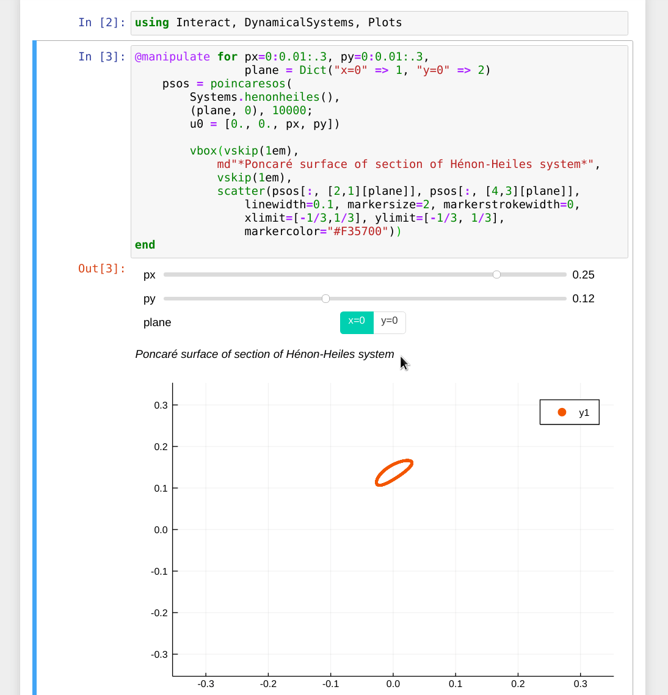

# Interact

[](https://travis-ci.org/JuliaGizmos/Interact.jl)
[](https://JuliaGizmos.github.io/Interact.jl/latest)

*Play with Julia code and share the fun!*

This package is a collection of web-based widgets that you can use to:

- Do quick code experiments where you can tweak the inputs
- Teach or share science
- Make simple UIs for your projects, and [publish them over the Web](#as-a-standalone-web-page)
- Make your own reusable widgets and publish them with your Julia library!

It works in [Jupyter notebooks](#ijulia--jupyter-notebooks), [Atom IDE](#within-the-atom-text-editor), or as a [plain old web page](#as-a-standalone-web-page).

# Usage

## @manipulate

The simplest way to use Interact is via the `@manipulate` macro.



The syntax of `@manipulate` is

```julia
@manipulate for var1=<object>, var2=<object>, etc...
    # do something with a, b, etc...
end
```

Here `<object>` can be one of the following:

- **A Range**: (any `AbstractRange` of Real numbers): this will create a slider using which you can select one value for the variable from the range.
- **An Array**: This will create a series of toggle buttons which you can select one at a time.
- **A Dictionary**: Same as the above, but keys are used as the labels for the buttons, the value corresponding to the selected key will be the value of the variable.
- **A String**: This will create a text box with the given string as the default value, you can edit the string to update the value of the variable.
- **A boolean**: This will create a checkbox which is checked if the value is true, unchecked if it is false. You can toggle the checkbox to change the value of this variable.
- **A number**: This will create a spinbox where you can input, increment or decrement a number. Note that an Integer will only allow input of integers.
- **A date or time**: (from the Dates standard library). this will create a date picker with the date set to the given date.
- **A color**: (from the Colors package.) This will create a color picker!
- **An Interact widget**: (advanced) see below for how to create widgets à la carte. Check out the [big list of widgets](https://juliagizmos.github.io/Interact.jl/latest/widgets/) here.
- **An Observable**: An [Observable](https://juliagizmos.github.io/Observables.jl/stable/) can be used here to assign its current value to the variable. Any update to the variable will trigger an update to the `@manipulate`. Note that the result of an `@manipulate` is also an observable!

## Widgets à la carte

You can also create widgets by themselves using the same input scheme. Just pass the `<object>` to `widget()` which has the syntax:

```julia
widget(<object>; label="<my label>")
```
For example,
```julia
px=widget(0:0.01:.3, label="px")
py=widget(0:0.01:.3, label="py")
plane = widget(Dict("x=0" => 1, "y=0" => 2), label="Section plane");
```
Then you can use `map` over the widgets to create new interactive output that depends on these widgets!

```julia
interactive_plot = map(plotsos, px, py, plane)
```

And put them all together into a nice little layout:

```julia
# stack vertically
vbox(
    hbox(px, py, plane), # stack horizontally
    interactive_plot)
```


If you would like _even more customization_ for your widgets, each type of widget has a different set of options you can tweak and different ways of updating it. So [head over to the documentation](https://juliagizmos.github.io/Interact.jl/latest/widgets/) about them!


_This demo has color and date pickers!_

[](https://vimeo.com/273565899)

# Getting started

Interact's output can be displayed either within Jupyter/Jupyterlab notebooks, the Atom text editor, or as a stand-alone web page. Below are the set up instructions for each of these front ends:


## IJulia + Jupyter notebooks
To set up Interact to work in Jupyter notebooks, first install Interact, IJulia and WebIO packages. Then install the required Jupyter extension by running:

```julia
using WebIO
WebIO.install_jupyter_nbextension()
```
**Important:** If you performed this step while the Jupyter notebook server is running, you will need to restart it for the extension to take effect.

> **If you have multiple Jupyter installations:**
> The `WebIO.install_jupyter_nbextension([jupyter])` function takes the path to the `jupyter` binary as an optional argument. If omitted, the installation first tries to find `jupyter` in your OS's default path. If it does not exist there, it tries to find a version that was installed using Conda.jl (which is the default when IJulia is installed without having an existing Jupyter set up, or by forcing it to install a copy via Conda.) If you have a `jupyter` binary in your OS path but also have a version installed via Conda and want to use the one installed via Conda, then you can set this keyword argument to be `WebIO.find_jupyter_cmd(condajl=true)`. For more information about the Jupyter integration, see [WebIO's documentation](https://juliagizmos.github.io/WebIO.jl/latest/providers/ijulia/). There is [more troubleshooting information here](https://juliagizmos.github.io/WebIO.jl/latest/troubleshooting/not-detected/).

## IJulia + JupyterLab

To set up Interact to work in JupyterLab, first install Interact, IJulia and WebIO packages. Then install the required JupyterLab extension by running:

```julia
using WebIO
WebIO.install_jupyter_labextension()
```
**Important:** If you performed this step while the JupyterLab server is running, you will need to restart it for the extension to take effect.

This function also takes the `jupyter` path as an optional argument. See the above subsection on installing on Jupyter notebooks for more description of the default behavior when this argument is omitted and pointers to troubleshooting information. **tl;dr:** if you launch JupyterLab via `IJulia.jupyterlab()`, run
```julia
using WebIO
WebIO.install_jupyter_labextension(condajl=true)
```
to force WebIO to be installed to the correct place.

## Within the Atom text editor

If you have set up the Julia integration provided by [Juno](https://junolab.org/), evaluating any expression which returns an Interact-renderable object (such as a widget or the output of `@manipulate`) will show up in a plot-pane within the editor. No extra setup steps are required.

## As a standalone web page

Any Julia function that returns an Interact-renderable object (such as a widget or the output of an `@manipulate`) can be repurposed to run as a simple web page served by the Mux web app framework.
```julia
using Mux, WebIO
function app(req) # req is a Mux request dictionary
 ...
end
webio_serve(page("/", app), 8000) # this will serve at http://localhost:8000/
```

### Bonus: Publish something to Heroku!

Check out [this repository](https://github.com/abhishalya/interact-deploy) which has a script to publish Interact app to Heroku with a simple command!

# Example notebooks

A great resource to learn to use the various features of Interact is to try out the example notebooks and the tutorial in the doc/notebooks/ directory. Start up IJulia from doc/notebooks/:

```julia
using IJulia
notebook(dir=".")
```

# Explore the wider widget ecosystem

Interact is built using [WebIO](https://github.com/JuliaGizmos/WebIO.jl) which is a "hub" package that supports an ecosystem of composable web-based widgets that all share the same availability on the Julia front-ends.

Check out this [introduction notebook](https://gist.github.com/shashi/3c3bc877ab1b5096232586cfbba0ef8b) about the WebIO ecosystem if you want to learn about how you can customize your UI using HTML, JavaScript and CSS. It will also get you started on writing your own widgets that others can use.

- [TableView.jl](https://github.com/JuliaComputing/TableView.jl): show a spreadsheet view of any Table datatype
- [CSSUtil](https://github.com/JuliaGizmos/CSSUtil.jl): wraps CSS functionality in easy Julia functions. Also renders
  markdown (and LaTeX). See the CSSUtil section in the introduction notebook linked above.
- _Your cool package_. Let us know by opening an issue to add your WebIO/Interact-based package here!

# Learning more

To learn more, check out the [documentation](https://JuliaGizmos.github.io/Interact.jl/latest/).
